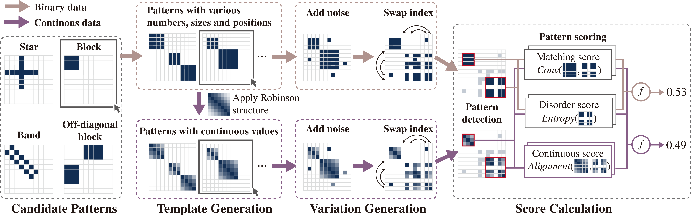

# ReorderData: A Dataset for Matrix Reordering

Related code for data generation, unified scoring models and reordering models in our paper "ReorderData: A Dataset for Matrix Reordering".

## Usage

### Generate Data

Check the folder `generator`. 

Generate matrices with different types of visual patterns(block, off-diagonal block, star, band) and matrix(binary, continuous) by `reorderdata_generator`.

### Unified Scoring Models
Check the folder `unified_scoring_model`.

We build unified scoring models based on the ReorderData dataset. This model aligns with the convolution- and entropy-based scoring method across all four visual patterns in both binary and continuous matrices and can also measure matrices of varying sizes. 

Use the models to evaluate the loss of the ReorderData test set, or to predict visual patterns in any matrices.

### Reordering Models
Check the folder `reordering_model`.

By treating the matrices with index swaps as negative samples and their ground-truth matrices as positive samples, we build a deep model for matrix reordering.

Use the model to test the reordering results on ReorderData test set.

## Contact
If you have any problem about our code, feel free to contact
reorderdata24@gmail.com
or describe your problem in Issues.

